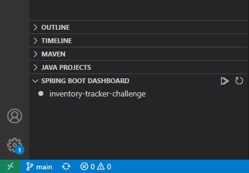
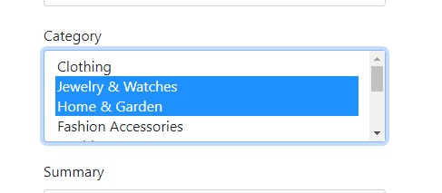

<div id="top"></div>

[![MIT License][license-shield]][license-url]
[![LinkedIn][linkedin-shield]][linkedin-url]

<br />
<div align="center">
  

  <h3 align="center">Inventory Tracker Challenge</h3>
  <h4 align="center">Shopify Backend Developer Intern - Summer 2022</h3>

  <p align="center">
<!-- <a href="https://marcinkoziel.ca">View Demo</a> 
    · -->
    <a href="https://github.com/marcin-koziel/inventory-tracker-challenge/issues">Report Bug</a>
    ·
    <a href="https://github.com/marcin-koziel/inventory-tracker-challenge/issues">Request Feature</a>
  </p>
</div>

<details>
  <summary>Table of Contents</summary>
  <ol>
    <li><a href="#built-with">Built With</a></li>
    <li>
      <a href="#getting-started">Getting Started</a>
      <ul>
        <li><a href="#prerequisites">Prerequisites</a></li>
        <li><a href="#installation">Installation</a></li>
      </ul>
    </li>
    <li><a href="#usage">Usage</a></li>
    <li><a href="#license">License</a></li>
    <li><a href="#contact">Contact</a></li>
  </ol>
</details>

### Built With

The following are the major frameworks/libraries used to bootstrap this project.

* [Spring Web](https://spring.io/guides/gs/spring-boot/)
* [Spring Security](https://spring.io/guides/gs/securing-web/)
* [Lombok](https://projectlombok.org/)
* [H2 Database](https://www.h2database.com/)
* [Spring Data JDBC](https://spring.io/projects/spring-data-jdbc)
* [Thymeleaf](https://www.thymeleaf.org/)
* [Bootstrap](https://getbootstrap.com//)

<p align="right">(<a href="#top">back to top</a>)</p>

## Getting Started

Considering numerous dependencies to this project exist, I will be using an ideal IDE such as Visual Studio Code to set up this project under installation.

### Prerequisites
To run this Spring Boot application in Visual Studio Code, you need to install the following:
* <a href="https://www.microsoft.com/openjdk">Java Development Kit (JDK)</a>
* <a href="https://marketplace.visualstudio.com/items?itemName=vscjava.vscode-java-pack">Extension Pack for Java</a>
* <a href="https://marketplace.visualstudio.com/items?itemName=pivotal.vscode-boot-dev-pack">Spring Boot Extension Pack</a>
* <a href="https://marketplace.visualstudio.com/items?itemName=GabrielBB.vscode-lombok">Lombok Annotations Support for VS Code</a>

<p align="right">(<a href="#top">back to top</a>)</p>

### Installation

1. Install _JDK 11 LTS_ or _JDK 17 LTS_ [https://www.microsoft.com/openjdk](https://www.microsoft.com/openjdk)

2. Open VS Code and Clone the repo
   ```sh
   git clone https://github.com/marcin-koziel/inventory-tracker-challenge.git
   ```
   
3. Install [Extension Pack for Java](https://marketplace.visualstudio.com/items?itemName=pivotal.vscode-boot-dev-pack)

4. Provided there are several Spring VS Code extensions, install the [Spring Boot Extension Pack](https://marketplace.visualstudio.com/items?itemName=vscjava.vscode-java-pack) which includes all required _Spring_ extensions.

5. Finally, install [Lombok Annotations Support for VS Code](https://marketplace.visualstudio.com/items?itemName=GabrielBB.vscode-lombok), which was used to minimize/remove the boilerplate code and save precious time!

6. Within VS Code _Explorer_, under the Spring Boot Dashboard tab, you can now run the project by clicking _Start..._ 

    

<p align="right">(<a href="#top">back to top</a>)</p>

## Usage

Open your browser once the application is running and go to [http://localhost:8080/](http://localhost:8080/) to use the web application! :thumbsup:

### CRUD

To enable **CRUD** functionality, visit the login page and enter the following credentials:

Username:

```
BestRecruiter
```

Password:

```
Password!
```

### Chosen Feature

Within the list of features provided to choose from, I went with the following:

```sh
Ability to assign/remove inventory items to a named group/collection
```

This feature is apparent on the following page, where multiple selections for _Categories_ are enabled, per _Product_.

**Add to Product** - [localhost:8080/admin/products/add](localhost:8080/admin/products/add)




<p align="right">(<a href="#top">back to top</a>)</p>

## License

Distributed under the MIT License. See `LICENSE.txt` for more information.

<p align="right">(<a href="#top">back to top</a>)</p>

## Contact

Marcin Koziel - [marcinzkoziel@gmail.com](marcinzkoziel@gmail.com)

Project Link: [https://github.com/marcin-koziel/inventory-tracker-challenge](https://github.com/marcin-koziel/inventory-tracker-challenge)

<p align="right">(<a href="#top">back to top</a>)</p>

[license-shield]: https://img.shields.io/github/license/othneildrew/Best-README-Template.svg?style=for-the-badge
[license-url]: https://github.com/marcin-koziel/inventory-tracker-challenge/blob/main/LICENSE.txt
[linkedin-shield]: https://img.shields.io/badge/-LinkedIn-black.svg?style=for-the-badge&logo=linkedin&colorB=555
[linkedin-url]: https://www.linkedin.com/in/marcin-koziel/
[product-screenshot]: images/screenshot.png
